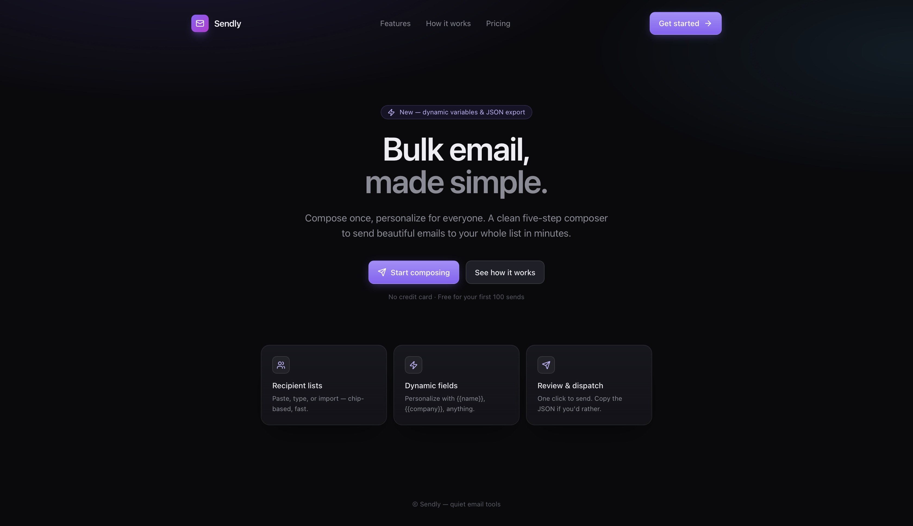
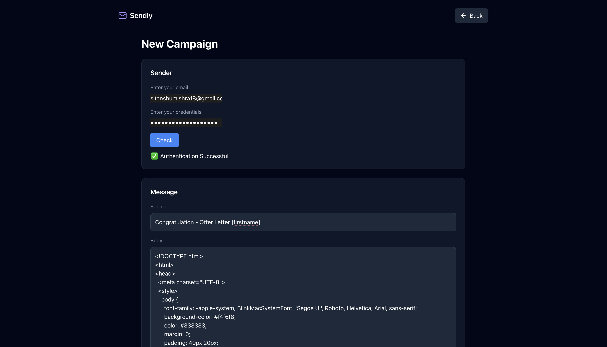
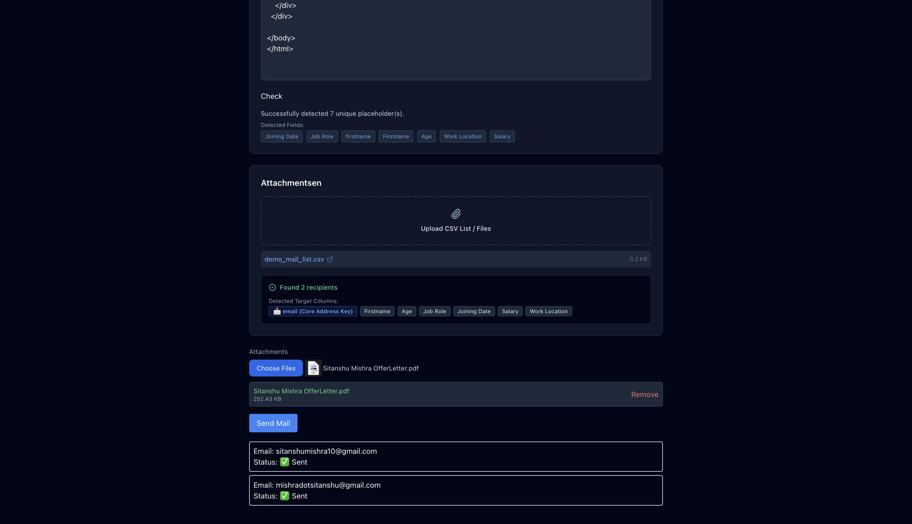
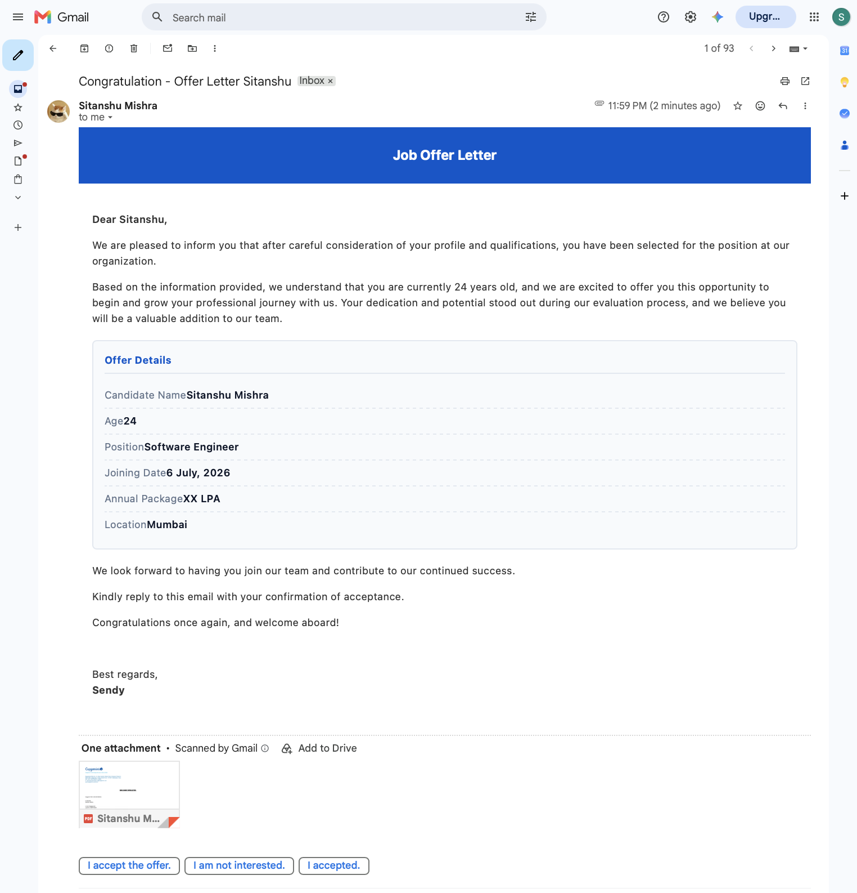

# 📧 Sendly

**Sendly** is a modern **Bulk Email Automation Platform** that allows users to send **personalized emails** to hundreds of recipients with just a few clicks. It supports **dynamic placeholders**, **CSV-based recipient imports**, **multiple attachments**, and **real-time email delivery status**, making bulk email campaigns simple and efficient.

---

## 🚀 Features

- 📩 **Bulk Email Sending** – Send personalized emails to multiple recipients simultaneously.
- 🧑‍💼 **Dynamic Placeholders** – Personalize emails using variables like `[Firstname]`, `[Age]`, `[Company]`, etc.
- 📂 **CSV Import** – Upload recipient lists directly through CSV files.
- 🔍 **Automatic Placeholder Detection** – Detects all placeholders used inside the email body and subject.
- 📑 **Attachment Support** – Attach one or multiple files to every outgoing email.
- 📧 **SMTP Authentication** – Authenticate using your email credentials before sending.
- 📊 **Recipient Validation** – Automatically validates uploaded recipient data.
- ✅ **Real-time Delivery Status** – Displays successful and failed email deliveries.
- 🎨 **Modern Responsive UI** – Clean dark-themed interface built for productivity.
- ⚡ **FastAPI Backend** – High-performance backend for email processing.

---

# 🖼️ Screenshots

## 🔹 Landing Page

A modern landing page introducing Sendly and its core features.



---

## 🔹 Create Campaign

Compose your email, authenticate your account, upload recipient list and attachments.



---

## 🔹 Placeholder Detection & Email Delivery

Automatically detects placeholders, validates recipient CSV files, supports attachments, and displays email delivery status.



---

## 🔹 Email Received

Recipients receive fully personalized emails with all placeholders replaced and attachments included.



---

# ⚙️ How It Works

1. Enter your sender email and SMTP credentials.
2. Compose your email subject and body.
3. Add dynamic placeholders such as:

```text
Hello [Firstname],

Your joining date is [Joining Date].

Your salary is [Salary].
```

4. Upload a CSV file containing recipient information.

Example:

| email | Firstname | Joining Date | Salary |
|--------|-----------|--------------|---------|
| abc@gmail.com | John | 10/08/2026 | ₹80,000 |
| xyz@gmail.com | Alice | 15/08/2026 | ₹90,000 |

5. Upload any attachments (PDFs, images, documents, etc.).
6. Click **Send Mail**.
7. Sendly replaces every placeholder with recipient-specific values and sends personalized emails individually.

---

# 🛠 Tech Stack

## 🖥️ Frontend

- React.js
- TypeScript
- Redux Toolkit
- Tailwind CSS
- Axios

---

## ⚙️ Backend

- FastAPI
- Python
- SMTP (Gmail)
- Pydantic
- Python Multipart

---

## 📦 File Processing

- CSV Parsing
- Dynamic Placeholder Extraction
- File Upload Handling
- MIME Email Attachments

---

# ⚙️ Installation & Setup

## 1. Clone the Repository

```bash
git clone https://github.com/your-username/sendly.git

cd sendly
```

---

# 🖥️ Frontend Setup

Move into frontend directory

```bash
cd frontend

npm install

npm run dev
```

Frontend runs at

```
http://localhost:5173
```

(or your configured Vite port)

---

# ⚙️ Backend Setup

Move into backend directory

```bash
cd backend

pip install -r requirements.txt
```

Run FastAPI server

```bash
uvicorn main:app --reload
```

Backend runs at

```
http://127.0.0.1:8000
```

---

# 📂 Project Structure

```text
Sendly
│
├── frontend
│   ├── Components
│   ├── Redux
│   ├── Pages
│   ├── Assets
│   └── App.tsx
│
├── backend
│   ├── main.py
│   ├── routes
│   ├── models
│   ├── utils
│   └── requirements.txt
│
└── README.md
```

---

# 🧩 Environment Variables

Create a `.env` file inside the backend.

```env
SMTP_SERVER=smtp.gmail.com
SMTP_PORT=587

FRONTEND_URL=http://localhost:5173
```

> Gmail users should generate an **App Password** and use it instead of their account password.

---

# 📄 CSV Format

The uploaded CSV should contain an **email** column along with any dynamic fields.

Example:

```csv
email,Firstname,Age,Job Role,Joining Date,Salary
john@gmail.com,John,24,Developer,10-08-2026,80000
alice@gmail.com,Alice,23,Designer,15-08-2026,70000
```

The placeholder names inside your email should exactly match the CSV headers.

Example:

```text
Hi [Firstname],

Congratulations!

Your designation is [Job Role].

Joining Date: [Joining Date]

Salary: [Salary]
```

---

# 🎯 Key Features

| Feature | Description |
|----------|-------------|
| 📧 Bulk Emails | Send emails to multiple recipients |
| 👤 Personalization | Dynamic placeholders for each recipient |
| 📂 CSV Import | Upload recipient lists easily |
| 📎 Attachments | Multiple file attachments |
| 🔍 Placeholder Detection | Detects placeholders automatically |
| 🔐 SMTP Authentication | Secure email verification |
| ✅ Delivery Status | Track sent/failed emails |
| 🎨 Responsive UI | Modern dark-themed interface |

---

# 📌 Future Improvements

- 📈 Email analytics dashboard
- 📬 Scheduled email campaigns
- 📊 Campaign history
- 📨 HTML email templates
- ☁️ Cloud file storage
- 📧 Support for SendGrid, Mailgun, Amazon SES, and Resend
- 👥 Contact list management
- 🔄 Retry failed email deliveries

---

# 🧠 Summary

| Category | Technologies |
|-----------|--------------|
| **Frontend** | React.js, TypeScript, Redux Toolkit, Tailwind CSS |
| **Backend** | FastAPI, Python, SMTP |
| **File Handling** | CSV Parsing, Multipart Uploads |
| **Email** | Personalized Bulk Emails, Attachments |
| **Core Features** | Dynamic Placeholders, CSV Import, SMTP Authentication, Delivery Status |

---

## ⭐ If you found this project useful, consider giving it a star on GitHub!
